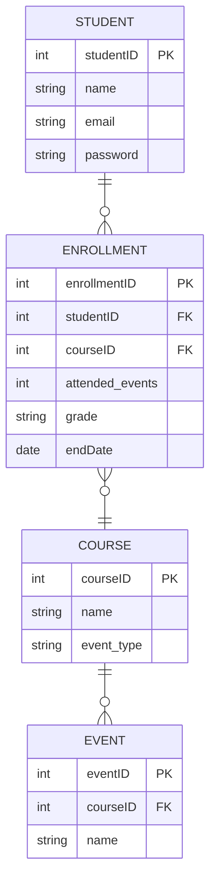

# Requirements Specification – Arts & Culture App 
Joshua Smith, Jinwon Yoo, Josiah Zempel

## Project Introduction 

This project is to design an app that will provide the same information that is in the Fine Arts email, along with additional information such as concerts, recitals, Concert, Drama, Opera series, art exhibitions, shows, lectures, theater productions.  

This app will also provide a way for Music Majors and students who are taking music classes to report their attendance at events. 

## Requirement Specifications 

| Requirement | Priority Level |
|---|---|
| Attendance Tracking | 1 |
| Tracking Student Requirements | 2 |
| Exporting attendance to Excel file for grading | 3 |
| Event List/Short Descriptions | 4 |

## Security Concerns 

* Tracking student information (ID#, name, email, password) 

* Tracking personal information such as credit card information should not be a concern since ticket purchasing will be handled through Showpass 

## Ways this is beneficial 

This project will streamline the process for tracking student attendance to required events. It will provide all the Fine Arts event information in one location for ease of access.  

## Implementation Recommendations 

* List of Fine Arts Events with a short description of the event (time, location, description). 
* QR code that students will scan to track attendance. 
  * React Native libraries, ZXing (Android), Core Image (iOS) 
* Ability to tag required events or other special events.  
* Link to Showpass for purchasing tickets. 
* In account set-up, specify student requirements (enrolled in Mu-98 or Mu-99) 
  * Keep track of required events, events attended 
* Push notification for upcoming events (Event reminders) 
  * OneSignal, Customer.io 
* Export attendance report to Excel file for grading. 
* Provide event location using BJU campus map

### E-R Diagram (rough draft)

## Project Conclusion 

This project is necessary as Bob Jones University and the Fine Arts department moves to using more digital media. This project will improve on existing ways that information is given to students and guests. This project will improve the existing ways that student attendance is tracked at Fine Arts events.

